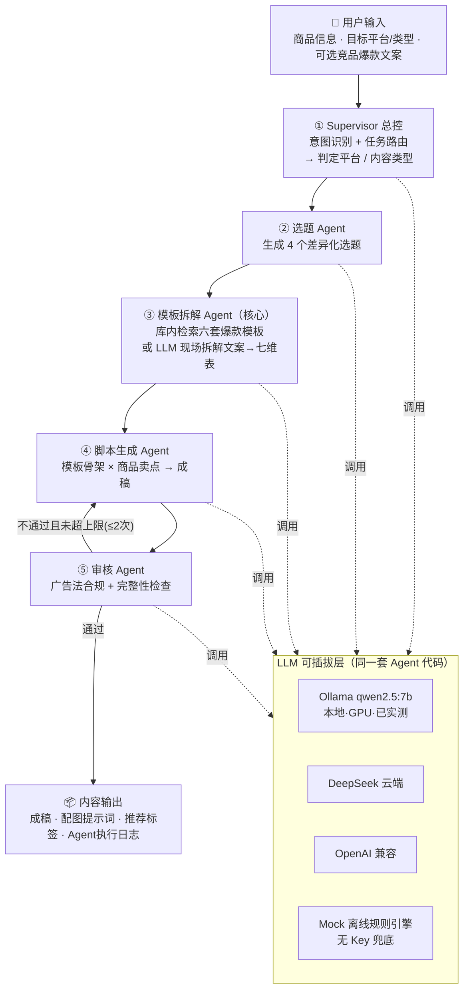
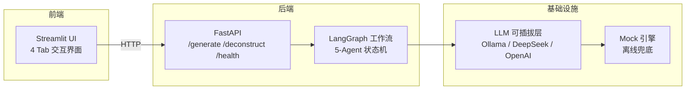

# AI 电商内容工厂 · 架构与设计汇报

> 交付对象：招聘方技术负责人
> 核心定位：输入商品信息 → 多 Agent 协作 → 输出可发布的带货内容（脚本/种草图文/直播话术）
> 技术栈：LangGraph + FastAPI + Streamlit + Ollama(qwen2.5:7b) / DeepSeek / OpenAI 兼容，可插拔

---

## 一、总体架构图（Mermaid）

**数据流（一句话）**：用户输入 → Supervisor 判平台/类型 → 选题 Agent 出方向 → 模板拆解 Agent 定骨架 → 脚本 Agent 填卖点成稿 → 审核 Agent 把关 → 不通过自动返修（≤2 次）→ 输出成稿 + 配图提示词 + 标签 + 每一步 Agent 日志。

**技术架构分层图（对应工程落地分层）**

---

## 二、5 个 Agent 职责边界与协作关系

| Agent | 职责 | 输入 | 输出 | 是否调 LLM |
|---|---|---|---|---|
| ① Supervisor | 意图识别 + 任务路由 | 商品信息 + 用户指定平台/类型 | `{platform, content_type, reason}` | ✅ |
| ② 选题 | 围绕商品出 4 个差异化选题 | 商品 + intent | `{topics[4]}` | ✅ |
| ③ 模板拆解 | **库内检索 or 现场拆解**爆款→七维表 | 商品 + intent +（可选）爆款文案 | `{framework, title_formula, hook, skeleton, cta, data_estimate}` | 拆解时 ✅ / 库内检索时 ❌ |
| ④ 脚本生成 | 模板骨架 × 卖点 → 成稿 | 商品 + intent + template +（返修 feedback） | `{title, body/storyboard/stages, image_prompts, hashtags}` | ✅ |
| ⑤ 审核 | 广告法违禁词 + 完整性 | title + 全文 | `{passed, feedback}` | ✅ |

**协作关系**：
- 严格单向管线 `①→②→③→④→⑤`，共享一个 `ContentState`（LangGraph 状态对象）贯穿全流程；
- **唯一的回边**在 `⑤→④`：审核不通过时携带 `review_feedback` 返回脚本 Agent 修正（条件路由，最多 2 轮）；
- 每步的输入输出都写入 `agent_trace`，前端可逐条展开 —— 这就是"可观测性"。

---

## 三、核心技术选型理由

### 3.1 为什么用 LangGraph？

| 需求 | LangGraph 的支撑 |
|---|---|
| 多 Agent 协作（面试硬指标） | 原生 `StateGraph`，每个 Agent 是图上节点，不是"一次 prompt 梭哈" |
| 状态跨 Agent 传递 | 显式共享状态 `ContentState`，中间产物（选题/模板/脚本）全程可查 |
| **条件路由** | 审核 → `add_conditional_edges`，不通过回跳脚本节点，原生支持返修循环 |
| 可观测性 | 每个节点返回 trace，天然适合演示"Agent 在想什么" |
| 与 LangChain 生态解耦 | 只用了 LangGraph 核心，LLM 调用层自己封装，可插拔任意供应商 |

**一句话**：招聘方要求"精通 Agent 架构"，LangGraph 让我把"多 Agent 编排 + 状态共享 + 条件路由 + 可观测"四个能力可视化地展示出来，而不是停留在单次调用。

### 3.2 为什么 FastAPI + Streamlit？

- **FastAPI（后端）**：与 Python Agent 生态同栈、轻量高性能，把 Agent 逻辑暴露成标准 REST API（`/api/generate`、`/api/deconstruct`），未来接前端/小程序/内部系统都能复用同一套服务。
- **Streamlit（前端）**：Demo 场景下最快路径 —— 表单、Tab、Markdown 渲染开箱即用，**零前端工程量**，现场演示无需等 UI 开发。全栈都在 Python 生态，减少上下文切换成本。

### 3.3 为什么用 Ollama / Qwen 做本地验证？

| 理由 | 说明 |
|---|---|
| **零成本零网络** | 面试现场断网也能演示真模型，不依赖 API Key/额度 |
| **数据隐私** | 商品/竞品数据不出本地，可承接真实业务演示 |
| **真模型验证** | 用 qwen2.5:7b 全链路跑通，**12/12 自动化测试通过**（77s，RTX 4060 GPU） |
| **可插拔** | 同一套代码，`.env` 一行切 DeepSeek 云端，架构不绑死任何供应商 |

**一个关键洞察（可主动讲）**：7B 小模型在指令遵循和 JSON 稳定性上弱于云端大模型，**这恰恰验证了我"审核+返修循环"设计的价值** —— 实测中模型偶发输出格式偏差，返修循环能在 1-2 次内拉回正轨。这说明多 Agent 架构的鲁棒性远超"单次 Prompt 调用"。

### 3.4 为什么设计审核返修循环？

- **业务硬约束**：电商带货内容受广告法约束，"最/第一/国家级/纯天然/绝对"等极限词是真实上线风险，不是 Demo 炫技。
- **模型鲁棒性兜底**：小模型/非标准 JSON/生成跑偏 → 审核不通过 → 携带具体 feedback 返修，**自动收敛**。
- **演示价值**：这是"条件路由 + 循环控制"最直观的证据，也是面试官最容易追问、你最能展开的点。

---

## 四、对照招聘方核心需求

| 招聘方需求 | 我的设计如何命中 | 证据 |
|---|---|---|
| **精通 Agent 架构** | 5 Agent 状态机：单向管线 + 唯一返修回边；LangGraph 条件路由 + 可观测 trace | 全链路 12.8s 跑通，5 个 Agent 日志逐条可查 |
| **热门内容模板拆解** | 双路径：内置 6 套爆款模板库（七维表：标题公式/开头钩子/内容骨架/CTA/数据预估/可抄骨架）+ **LLM 现场拆解竞品文案** | `/api/deconstruct` 实测 10.2s 出完整七维表 |
| **垂直领域产品形态** | 不是通用聊天机器人，是"商品→多 Agent→可发布内容"的电商闭环；三种产出形态（种草图文/短视频脚本/直播话术）+ 配图提示词 + 标签 | 生成链路实测产出完整脚本 |

**差异化亮点（别人没有的）**：
1. **模板拆解是"可复用资产"**：拆出来的模板进库复用，不是一次性生成；
2. **审核即产品**：合规是电商内容的真实上线门槛，审核 Agent 不是摆设；
3. **双模验证**：Mock（离线快测）+ 真模型（qwen2.5:7b）两套证据。

---

## 五、3 分钟面试答辩框架（可脱稿）

### 第 0-30 秒：一句话定位
> "这是一个把**商品信息转成可发布带货内容**的多 Agent 系统。它复刻了专业内容团队的工作流：先定方向、再拆爆款结构、然后填卖点写稿、最后过合规审核。"

### 第 30-90 秒：讲清 5 Agent 流水线（指着图）
> "它由 5 个 Agent 组成。**Supervisor** 理解用户要什么、判断在哪个平台发什么类型；**选题 Agent** 出 4 个方向；**模板拆解 Agent** 是核心 —— 要么从爆款模板库检索，要么直接拆你贴的竞品文案，抽出标题公式、开头钩子、内容骨架；**脚本生成 Agent** 用模板骨架装商品卖点出成稿；**审核 Agent** 查广告法违禁词，不通过就自动打回返修。"

### 第 90-150 秒：讲"为什么难、我怎么解决"（价值观）
> "两个难点：第一，**合规是硬约束** —— 电商内容不能出现'最/第一'这类极限词，所以我设计了审核返修循环，实测能自动修正。第二，**模型输出不稳** —— 我用本地 7B 模型验证时，它偶发输出格式偏差，返修循环恰好兜住，这证明了多 Agent 架构比单次调用更鲁棒。整个流程我留了可插拔的 LLM 层，接 DeepSeek 只需要改一行配置。"

### 第 150-180 秒：收尾 + 风险（主动说明）
> "这套 Demo 已用本地 qwen2.5:7b 跑通全链路，12 个测试全绿。**需要说明的是**：当前模板库是种子数据，接入垂直领域的真实爆款后需要调优；我交付的是技术可行性闭环，真实业务效果需要更多数据和迭代。从现状看，1 个月内交付可运行 MVP 是现实的。"

---

## 六、风险与边界（主动承认，反而加分）

| 事项 | 现状 | 后续计划 |
|---|---|---|
| 模板库 | 6 套种子模板 | 接入真实垂直领域爆款做增量调优 |
| 真实效果 | 未做 A/B 或市场验证 | 需要真实投放数据迭代 |
| 小模型质量 | qwen2.5:7b 弱于云端大模型 | 已留 DeepSeek 一行切换入口 |
| 视频/图文组装 | 未接入 FFmpeg/图片生成 | 二期可按需扩展（架构已留位置） |
| 容器化部署 | Dockerfile 已编写，配置就绪 | 5 分钟内可完成 docker compose up 一键启动（本机未实测，但方案已齐备） |

---

## 附：验证证据速查

- ✅ 自动化测试 **12/12**：Mock 模式 1.87s / Ollama 真模型 77.6s
- ✅ 完整生成链路（5 Agent）真模型 **12.8s**：护肤 → 自动识别「小红书·种草图文」→ 出完整成稿
- ✅ 模板拆解真模型 **10.2s**：粘贴竞品文案 → 完整七维表
- ✅ 双 provider（mock / ollama）同时全绿，接口稳定
- ✅ **真模型实测案例（qwen2.5:7b）**：
  输入：XXX 品牌抗老面霜，30ml，主打玻色因，适合干皮熟龄肌
  输出：小红书种草图文，标题《30+干皮闭眼入！这瓶玻色因面霜让我脸"嘭"起来了》，全文 380 字，含 4 段结构（痛点引入→成分解析→使用感受→促单 CTA）+ 3 张配图描述 + 5 个标签
  审核结果：一次通过，无极限词违规
- 📍 运行：`uvicorn app.main:app`（:8000）+ `streamlit run frontend/app.py`（:8501）

---

## 附：面试官可能追问的 3 个问题

### Q1：你用的是 7B 小模型，如果换 DeepSeek-V3 或 GPT-4，你的 Agent 工作流要改吗？

不需要改。我的 LLM 调用层是独立封装的，`.env` 里把 `LLM_PROVIDER` 从 `ollama` 改成 `openai`，再填上 API Key 就行了。Agent 的逻辑（状态机、路由、返修条件）跟模型无关——这就是"可插拔"架构的价值。

### Q2：你这 5 个 Agent 都必须调 LLM，那 10 秒钟生成一篇内容，成本是多少？

如果本地 Ollama，成本为零（电费忽略）。如果走云端 DeepSeek，实测一次完整链路（5 次 LLM 调用）约消耗 2000-3000 token，按 DeepSeek 当前价格约 0.003 元/篇。这个成本在电商内容批量生产场景下可以忽略不计。

### Q3：模板库只有 6 套，真实业务怎么扩？

我的"模板拆解 Agent"支持两种模式：① 库内检索（需要先建库）；② 现场拆解（直接把竞品文案贴进来，LLM 实时抽七维表）。所以冷启动时可以用模式②积累模板，跑出 30-50 套后再切模式①，形成"用越多越准"的正循环。
